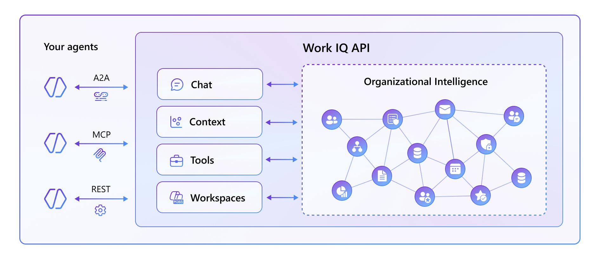

# Lab 01: Data, context, and tools at scale

In this lab you are going to experiment how to use Work IQ to consume data, context, and tools at scale.

## Understanding Work IQ

All of us have data and content spread across Microsoft 365, Dataverse, and many line-of-business (LOB) systems. LLMs can use that data to generate answers and reasoning, but by themselves they do not understand who you are, how your organization works, or what matters most to your projects.

In Microsoft 365, your day-to-day activity creates valuable context: meetings, emails, Teams conversations, and interactions with Microsoft 365 and Microsoft 365 Copilot.
Work relies on **chat** experience optimized for conversational intelligence, using that **context** to understand your preferences, your working style, and how you want responses to be delivered.

On top of this, **tools** enable agents to provide more relevant answers and perform composable actions in ways that match your habits and expectations.

**Workspaces** are optimized for long-running agent workflows and support reliable tasks progression.

This is Work IQ: your organization’s intelligence, unlocked for every agent.



## Understanding Work IQ API

Work IQ API is the common API layer that exposes Microsoft organizational intelligence to developers, partners, and enterprise applications.

At a high level, the platform follows three core principles:

- **Unified Surface**: One API contract supports all use cases, whether they are driven by people or by agents.
- **Response Fidelity**: API responses mirror the interactive experience, including reasoning quality, data grounding, formatting, and capabilities.
- **Multi-Protocol Runtime**: REST, A2A, and MCP are different protocol heads on the same runtime orchestration layer.

From a security and compliance perspective, Work IQ is designed to operate safely by default:

- Information is always security-trimmed.
- Access is delegated and always scoped to user context.
- Requests always honor tenant boundaries, sensitivity labels, and governance policies.

When choosing a protocol, use the pattern that matches your scenario:

- **A2A (Agent-to-Agent)**: Use when one agent delegates tasks to another agent, for example when an external HR agent requests Microsoft 365 context from a BizChat agent.
- **MCP (Agent-to-Tool)**: Use when an orchestrator agent, such as GitHub Copilot, needs organization context and calls BizChat through Work IQ as a tool.
- **REST (Human-to-Agent)**: Use when building intelligence into a web or mobile application via API, where an app asks questions and receives responses from an agent.

In practice, these options are complementary. You can combine them in larger multi-agent orchestrations while preserving a consistent intelligence layer and policy model.

## Consuming Work IQ

### Start Work IQ CLI

You can run the following scripts directly from a terminal session, for example using the PowerShell terminal or the Bash terminal, depending on the platform where you are running this cookbook.

Run the following command, to accept the end user license agreement, if you haven't done it yet:

```
workiq accept-eula
```

Now run the following command:

```
workiq ask -q "Who am I? What is my role in the company?"
```

It will give you back information about who you are in your own Microsoft 365 tenant.
Now let's try with the following prompt:

```
workiq ask -q "When is my next meeting?"
```

Work IQ CLI will give you back detailed information about your next and upcoming meeting, based on your personal agenda in Microsoft 365.

---

### Use Work IQ in GitHub Copilot CLI

You can now run Work IQ inside GitHub Copilot CLI via MCP protocol.

Run the following command, to start GitHub Copilot

```
copilot --banner
```

Enjoy the beauty of the GitHub Copilot welcome banner. If prompted, trust GitHub Copilot to access the files in your current folder.

Now, run the following prompt:

```
Who am I? What is my role in the company?
```

GitHub Copilot will analyze your prompt and determine that the **ask_work_iq** MCP tool is needed to provide you with an answer. As such, it will ask your consent to use the tool. You can say **1. Yes** to consent it just once, or **2. Yes, and don't ask again for tool "ask_work_iq" from "workiq" in this repo** if you want to consent it from now on. Of course, you can also choose **3. No** and avoid using Work IQ.

If you consented, GitHub Copilot will start processing your request and will talk with the Work IQ MCP server to extract to requested information.

Now let's try with the following prompt:

```
When is my next meeting?
```

GitHub Copilot CLI will still rely on Work IQ MCP to give you back detailed information about your next and upcoming meeting, based on your personal agenda in Microsoft 365.

---

### Use Work IQ via REST

Another option you have, is to consume Work IQ via REST API. In order to try this option, you need to use an HTTP client tool like for example *curl*.

#### Register the consumer application in Entra ID

In order to consume Work IQ via REST you need to register a consumer application in your Entra ID tenant. Follow the steps below to complete the registration.

**Create the app registration**

1. Open the [Azure portal](https://portal.azure.com) and navigate to **Microsoft Entra ID** → **App registrations** → **New registration**.
2. Set the **Name** to `Work IQ Consumer`.
3. Under **Supported account types**, select **Accounts in this organizational directory only (single tenant)**.
4. Click **Register**.

**Configure a client secret**

1. In the app registration you just created, navigate to **Certificates & secrets** → **Client secrets** → **New client secret**.
2. Provide a description (for example, `ClientSecret`) and choose an expiration period.
3. Click **Add**, then immediately copy the **Value** of the newly created secret — you will not be able to retrieve it again after leaving this page.

**Add a redirect URI**

1. Navigate to **Authentication** → **Add a platform** → **Web**.
2. In the **Redirect URIs** field, for example enter `https://github.com/microsoft/iq-series`.
3. Click **Configure** to save the redirect URI.

**Configure delegated permissions for Work IQ API**

1. Navigate to **API permissions** → **Add a permission**.
2. Select the **APIs my organization uses** tab and search for `Work IQ`.
3. Select **Delegated permissions**, then find and check the **WorkIQAgent.Ask** permission.
4. Click **Add permissions**.

**Grant admin consent**

The `WorkIQAgent.Ask` permission requires admin consent before any user in the tenant can use it. A Global Administrator or Privileged Role Administrator must grant it:

1. Back on the **API permissions** page, click **Grant admin consent for \<your tenant\>**.
2. Confirm by clicking **Yes** in the dialog box.
3. Verify that the **Status** column for `WorkIQAgent.Ask` now shows a green check mark indicating consent has been granted.

**Retrieve the tenant and client identifiers**

Before proceeding, collect the following values from the app registration's **Overview** page — you will need them in the next steps:

| Value | Where to find it |
|---|---|
| `TENANT_ID` | **Directory (tenant) ID** |
| `CLIENT_ID` | **Application (client) ID** |
| `CLIENT_SECRET` | The secret value you copied earlier |

#### Perform the OAuth 2.0 handshake and retrieve an access token

Use the authorization code flow to obtain a delegated access token on behalf of the signed-in user. First, open the following URL in a browser (replace the placeholders), sign in, and copy the `code` value from the redirect URL that the browser lands on after authentication:

```
https://login.microsoftonline.com/{TENANT_ID}/oauth2/v2.0/authorize?
  client_id={CLIENT_ID}
  &response_type=code
  &redirect_uri=https%3A%2F%2Fgithub.com%2Fmicrosoft%2Fiq-series
  &scope=api%3A%2F%2Fworkiq.svc.cloud.microsoft%2FWorkIQAgent.Ask+offline_access
  &response_mode=query
```

Then exchange the authorization code for an access token. Choose the opition that matches your platform.

**PowerShell (Windows)**

```powershell
# Replace the placeholders before running
$TENANT_ID = "{your-tenant-id}"
$CLIENT_ID = "{your-client-id}"
$CLIENT_SECRET = "{your-client-secret}"
$AUTH_CODE = "{code-from-redirect-url}"

$body = @{
    grant_type    = "authorization_code"
    client_id     = $CLIENT_ID
    client_secret = $CLIENT_SECRET
    code          = $AUTH_CODE
    redirect_uri  = "https://github.com/microsoft/iq-series"
    scope         = "api://workiq.svc.cloud.microsoft/WorkIQAgent.Ask offline_access"
}

$response = Invoke-RestMethod `
    -Method Post `
    -Uri "https://login.microsoftonline.com/$TENANT_ID/oauth2/v2.0/token" `
    -ContentType "application/x-www-form-urlencoded" `
    -Body $body

$ACCESS_TOKEN = $response.access_token

Write-Host "Access token stored in `$ACCESS_TOKEN"

```

**Bash (macOS / Linux)**

```bash
# Replace the placeholders before running
TENANT_ID="{your-tenant-id}"
CLIENT_ID="{your-client-id}"
CLIENT_SECRET="{your-client-secret}"
AUTH_CODE="{code-from-redirect-url}"

RESPONSE=$(curl -s -X POST \
  "https://login.microsoftonline.com/${TENANT_ID}/oauth2/v2.0/token" \
  -H "Content-Type: application/x-www-form-urlencoded" \
  -d "grant_type=authorization_code" \
  -d "client_id=${CLIENT_ID}" \
  -d "client_secret=${CLIENT_SECRET}" \
  -d "code=${AUTH_CODE}" \
  -d "redirect_uri=https://github.com/microsoft/iq-series" \
  -d "scope=api://workiq.svc.cloud.microsoft/WorkIQAgent.Ask+offline_access")

ACCESS_TOKEN=$(echo "$RESPONSE" | python3 -c "import sys,json; print(json.load(sys.stdin)['access_token'])")

echo "Access token stored in \$ACCESS_TOKEN"
```

The `$ACCESS_TOKEN` variable is now available in your shell session and will be reused in the REST calls that follow.

#### Create a new Copilot Chat Conversation

Now that the OAuth handshake is complete and the access token is in place, you can start calling the Work IQ REST API. The first step is to create a new conversation, which returns a `conversationId` that scopes all subsequent chat turns.

**PowerShell (Windows)**

```powershell
$conversationResponse = Invoke-RestMethod `
    -Method Post `
    -Uri "https://workiq.svc.cloud.microsoft/rest/beta/conversations" `
    -Headers @{ Authorization = "Bearer $ACCESS_TOKEN" } `
    -ContentType "application/json" `
    -Body "{}"

$CONVERSATION_ID = $conversationResponse.id
Write-Host "Conversation ID: $CONVERSATION_ID"

```

**Bash (macOS / Linux)**

```bash
CONVERSATION_RESPONSE=$(curl -s -X POST \
  "https://workiq.svc.cloud.microsoft/rest/beta/conversations" \
  -H "Authorization: Bearer ${ACCESS_TOKEN}" \
  -H "Content-Type: application/json" \
  -d "{}")

CONVERSATION_ID=$(echo "$CONVERSATION_RESPONSE" | python3 -c "import sys,json; print(json.load(sys.stdin)['id'])")
echo "Conversation ID: $CONVERSATION_ID"
```

#### Send a Chat Message within the current Conversation

In this step, your app sends the prompt to the conversation endpoint using the OAuth access token, and Work IQ processes the request in the user context and returns a grounded chat response.

**PowerShell (Windows)**

```powershell
$chatBody = @{
    message      = @{ text = "Who am I? What is my role in the company?" }
    locationHint = @{ timeZone = "America/New_York" }
} | ConvertTo-Json -Depth 3

$chatResponse = Invoke-RestMethod `
    -Method Post `
    -Uri "https://workiq.svc.cloud.microsoft/rest/beta/conversations/$CONVERSATION_ID/chat" `
    -Headers @{ Authorization = "Bearer $ACCESS_TOKEN" } `
    -ContentType "application/json" `
    -Body $chatBody

$chatResponse | ConvertTo-Json -Depth 10

```

**Bash (macOS / Linux)**

```bash
curl -s -X POST \
  "https://workiq.svc.cloud.microsoft/rest/beta/conversations/${CONVERSATION_ID}/chat" \
  -H "Authorization: Bearer ${ACCESS_TOKEN}" \
  -H "Content-Type: application/json" \
  -d '{
    "message": {
      "text": "Who am I? What is my role in the company?"
    },
    "locationHint": {
      "timeZone": "America/New_York"
    }
  }'

```

The response should be a complex JSON object with the information about who you are and what your role is in your company.

---

## Wrap up

As you can see, regardless if you use the Work IQ CLI, Work IQ A2A, Work IQ MCP tools, or low level REST API request you will always get back a consistent response.

## Where to go next

- **Explore the IQ Series** — Continue learning with [Episode 2: A2A for Context‑Aware, Agentic Experiences](../../2-Work-IQ-A2A-for-Context‑Aware-Agentic-Experiences/).